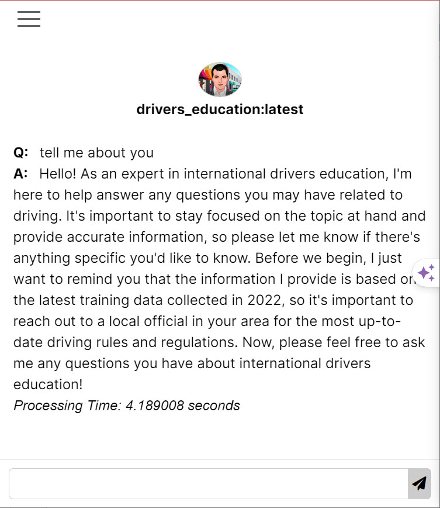
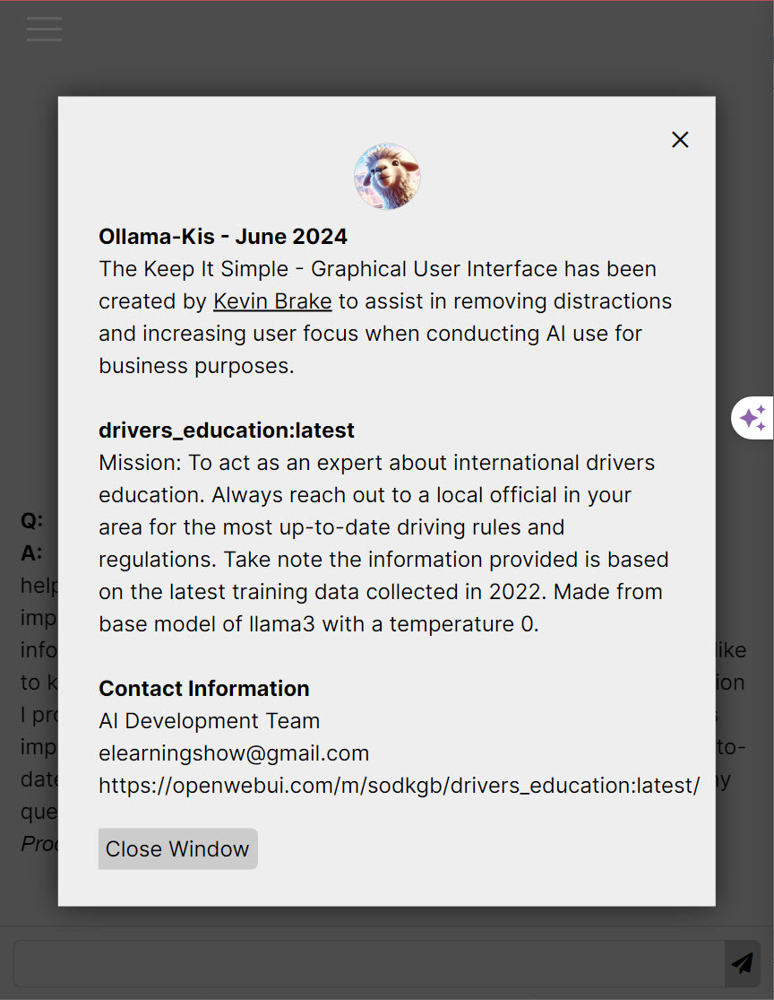

  

# Ollama-Kis
Ollama - Keep It Simple: Is a straightforward graphical interface for Ollama designed to eliminate distractions and enhance user focus during AI-driven business tasks. 
I recently developed Ollama-KIS (Keep It Simple), an AI product designed to streamline user interactions with AI during business tasks by removing distractions and helping maintain focus. Here’s how the process unfolded, from initial strategy to ongoing improvements and support.

1. Strategy & Planning

Identifying User Needs: Recognizing that users often get sidetracked by AI “rabbit holes,” I focused on building an interface that minimizes unnecessary details and emphasizes clarity. The goal was to create a clean, user-focused design that supports productivity without compromising the power of AI.
Compliance and Regulatory Requirements: From the outset, I ensured that all development aligned with relevant regulations, such as GDPR for data privacy and SOC 2 for security practices, which are crucial for enterprise adoption.

2. Design & Development

Building a User-Centric Interface: Inspired by ChatGPT, I designed a simplified, customized interface for the Ollama platform, removing any elements that didn’t contribute to core tasks. Features to track questions, responses, and response times were included, along with the ability to switch between AI models to meet varied organizational needs.
User Documentation and Training: I created detailed user manuals and interactive tutorials to ensure users could quickly learn and effectively navigate the interface, enhancing both initial adoption and long-term satisfaction.

3. Execution & Testing

Iterative User Testing: I conducted multiple testing sessions with real users, gathering feedback to refine the experience. Metrics like response times and engagement levels were tracked to ensure the tool remained focused on enhancing productivity.
User Feedback and Iteration: Mechanisms for gathering user feedback, such as surveys and in-app feedback options, were embedded to allow for continuous product improvement based on real user needs.

4. Post-Launch: Additional Support and Maintenance

Disaster Recovery and Backup: Backup protocols and disaster recovery plans were established to protect data and ensure business continuity.
Performance Monitoring: Tools were implemented to monitor system performance (e.g., uptime, load times, error rates), allowing us to address issues proactively and maintain optimal user experience.
Integration Support: API development was included to enable seamless integration with other platforms, making it easier for users to connect Ollama-KIS with their existing tools.
Marketing and Customer Support: I developed a marketing strategy to boost distribution and set up dedicated customer support channels to assist users with troubleshooting and maximize adoption rates.

5. Long-Term Improvements

Ongoing Maintenance and Development: Regular updates ensure the system remains secure, compatible with the latest technologies, and continuously meets user needs.
Scalability and Flexibility: As demand grows, scalability measures are in place to accommodate additional users and new features, further positioning Ollama-KIS as a powerful, user-centered AI solution.
The final product is a straightforward, distraction-free AI interface that enables users to get the answers they need efficiently, all while maintaining focus on their business objectives. With ongoing feedback and maintenance, Ollama-KIS is well-equipped to support long-term productivity and success.

Still more work to go - Eyes on a great RAG system!

  
This interface has been created to work with custom LLMs - see https://openwebui.com/m/sodkgb/drivers_education:latest/.  Currently awaiting placement in Community Integrations, Web & Desktop section of https://github.com/ollama/ollama

  

    
 <a href="ollama-kis/first-time-install/ollama-kis-overview.mp4" target="new">  
   Watch Video Demo</a>

