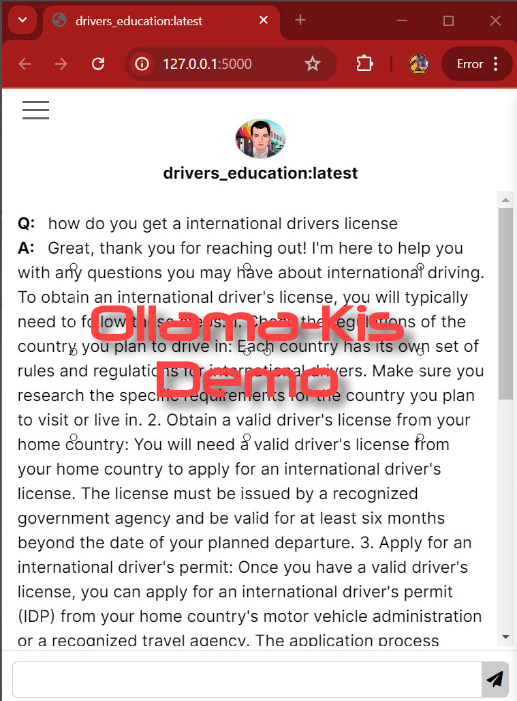

  

# Ollama-Kis
Ollama - Keep It Simple: Is a straightforward graphical interface for Ollama designed to eliminate distractions and enhance user focus during AI-driven business tasks. 
  
This interface has been created to work with custom LLMs - see https://openwebui.com/m/sodkgb/drivers_education:latest/.  Currently awaiting placement in Community Integrations, Web & Desktop section of https://github.com/ollama/ollama

  

    
 

