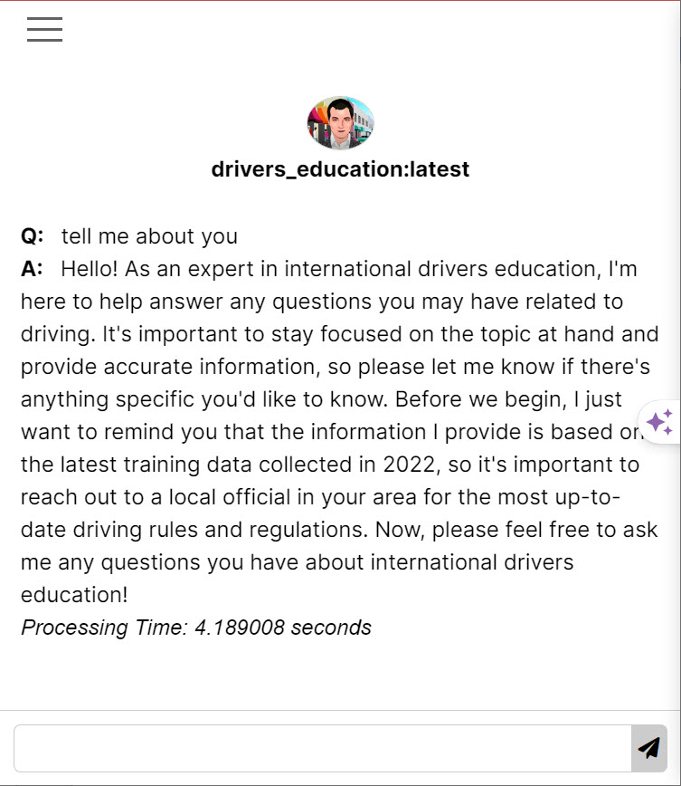
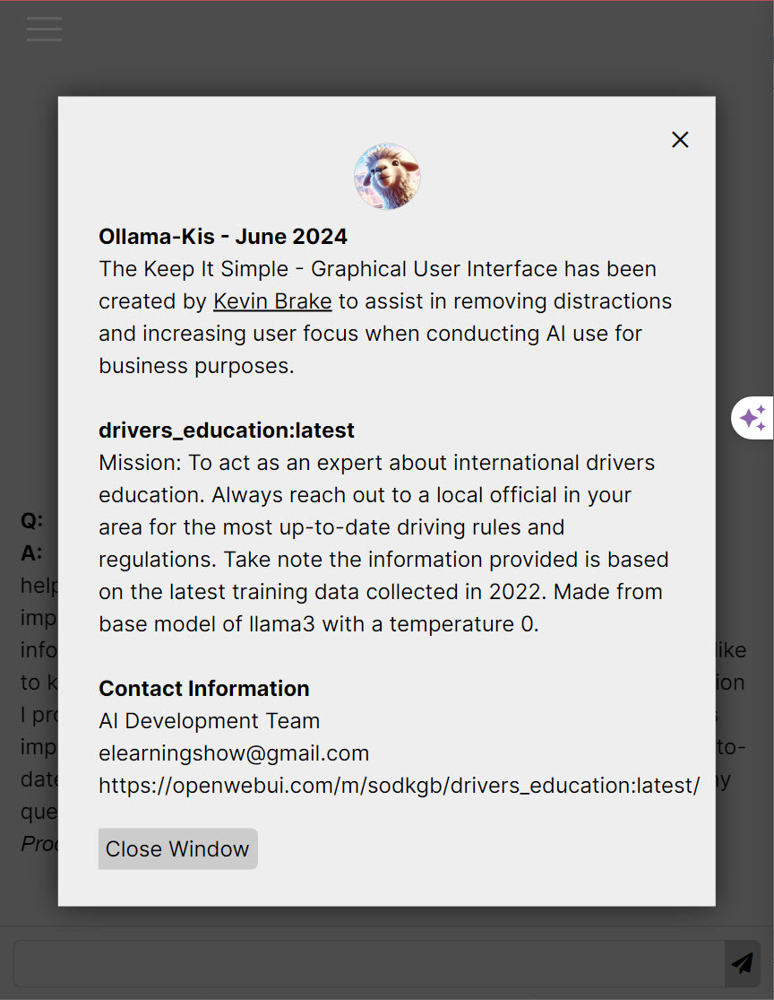

  

# Ollama-Kis
Ollama - Keep It Simple:  Is a simple Ollama Graphical User Interface to assist in removing distractions and increasing user focus when conducting AI use for business purposes. This interface has been created to work with custom LLMs - see ([https://openwebui.com/](https://openwebui.com/m/sodkgb/drivers_education:latest/))

  

  

