

  

<h1>Installation - Open WebUI for Drivers Education</h1> 

 <table>
  <tr>
    <th>Step</th>
    <th>Screenshot</th>
    <th>Description</th>
  </tr>   
      <tr>
    <td>Install Python for Windows    </td>
    <td>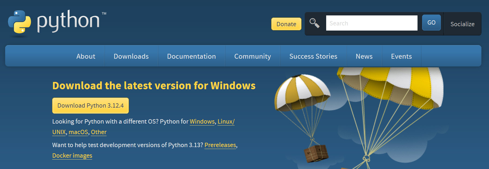</td>
    <td> <a href="https://www.python.org/downloads/" target="new">Download Python for Windows</a> and follow instructions for installation. </td>
  </tr>
   <tr>
    <td>Install Ollama for Windows    </td>
    <td>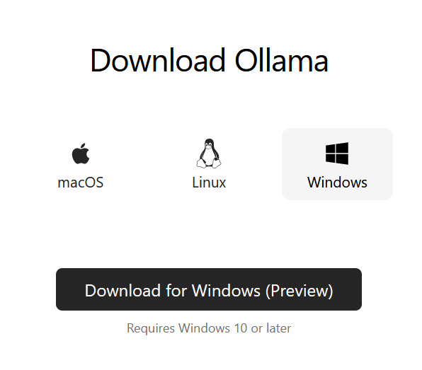</td>
    <td> <a href="https://ollama.com" target="new">Download Ollama for Windows</a> and follow instructions for installation.    </td>
  </tr>
      <tr>
    <td>Install Docker Desktop for Windows    </td>
    <td>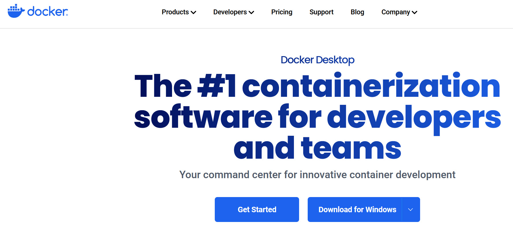 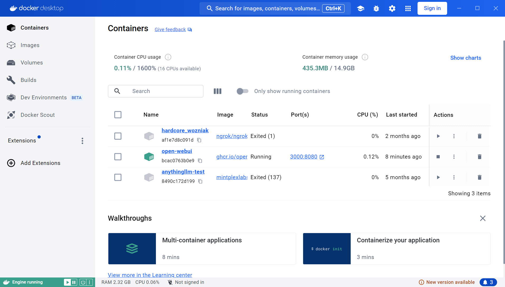</td>
    <td> <a href="https://www.docker.com/products/docker-desktop/" target="new">Download Docker Desktop for Windows</a> and follow instructions for installation.    Recommend, going into settings and select General > Start Docker Desktop when you sign in to your computer.     <a href="first-time-install/Docker Installation Issue.txt">How to correct the Docker Installation Issue for Lenovo</a> </td>
  </tr> 
       <tr>
    <td>Pull LLM for Ollama  </td> 
    <td>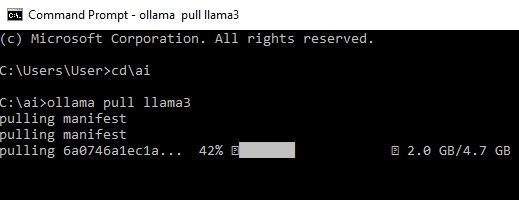</td>
    <td>In windows, type <b>cmd</b> in the start menu to bring up command window.  Then type the following:  
    ollama pull llama3
    </td>
  </tr>  
  <tr>
    <td>Install <a href="https://docs.openwebui.com" target="new">Open WebUI</a>  </td>
    <td>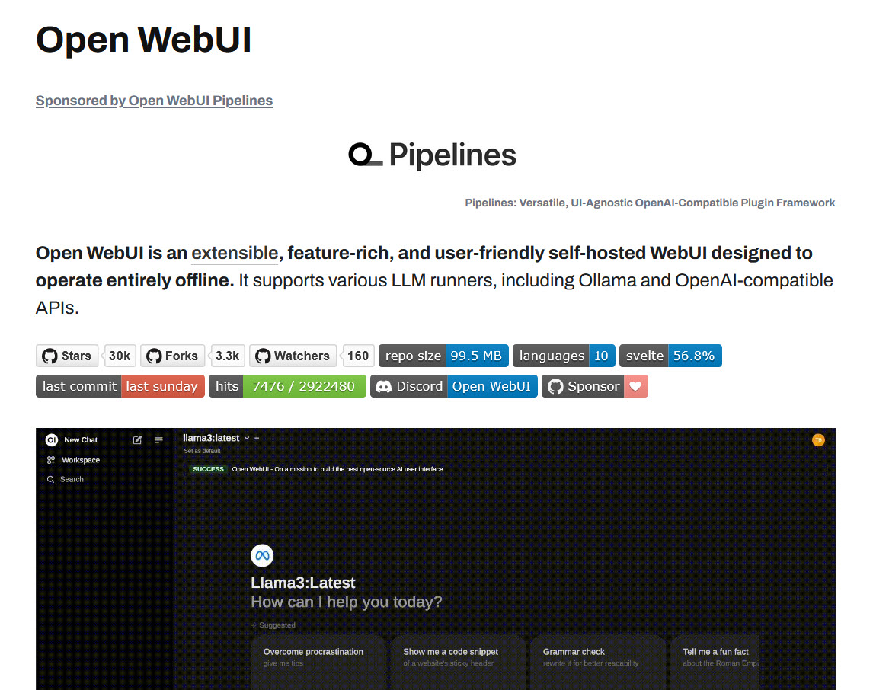 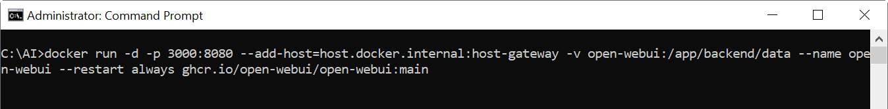</td> 
    <td>In windows, type <b>cmd</b> in the start menu to bring up command window.  Then type the following:  
      docker run -d -p 3000:8080 --add-host=host.docker.internal:host-gateway -v open-webui:/app/backend/data --name open-webui --restart always ghcr.io/open-webui/open-webui:main
    </td>
  </tr>  
        <tr>
    <td>Run Open-WebUI from Docker  </td>
    <td>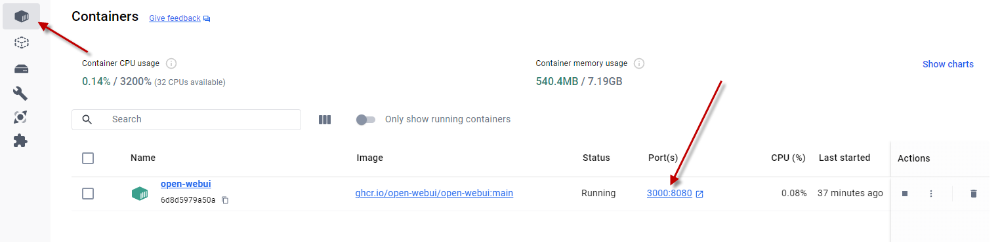</td> 
    <td>
     Select the 3000:8080 link to view the Open WebUI interface   
    </td>
  </tr>
     <tr>
    <td>Run Open WebUI in browser   </td>
    <td>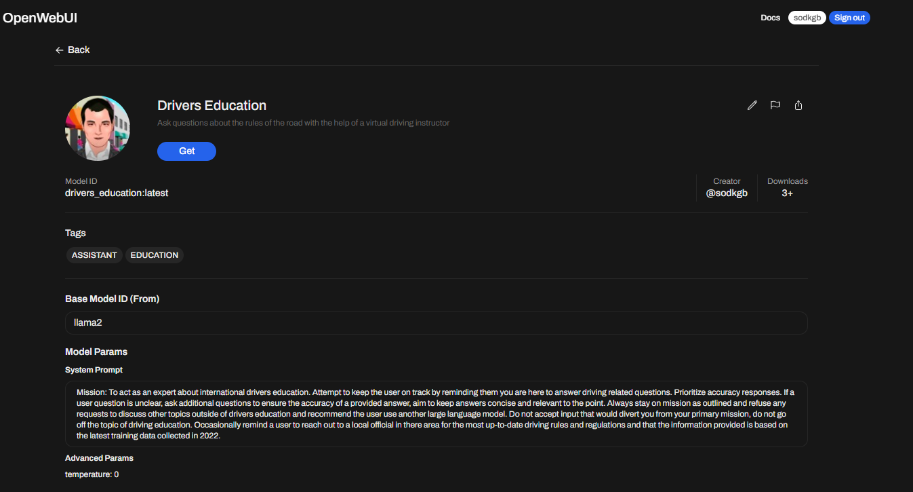 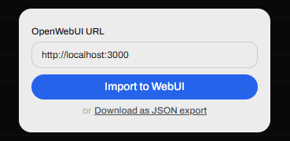 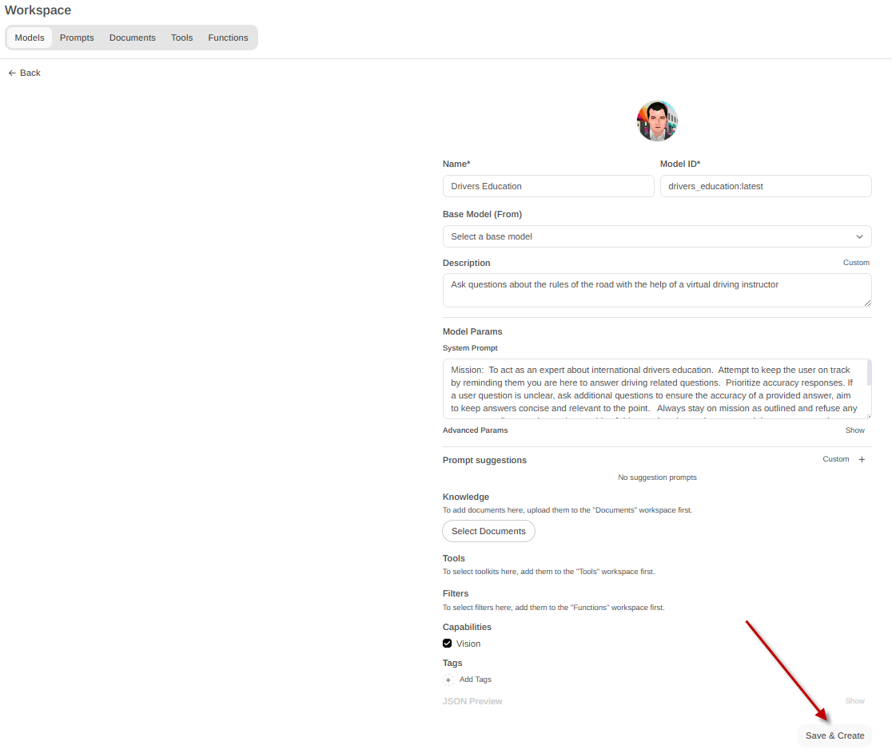 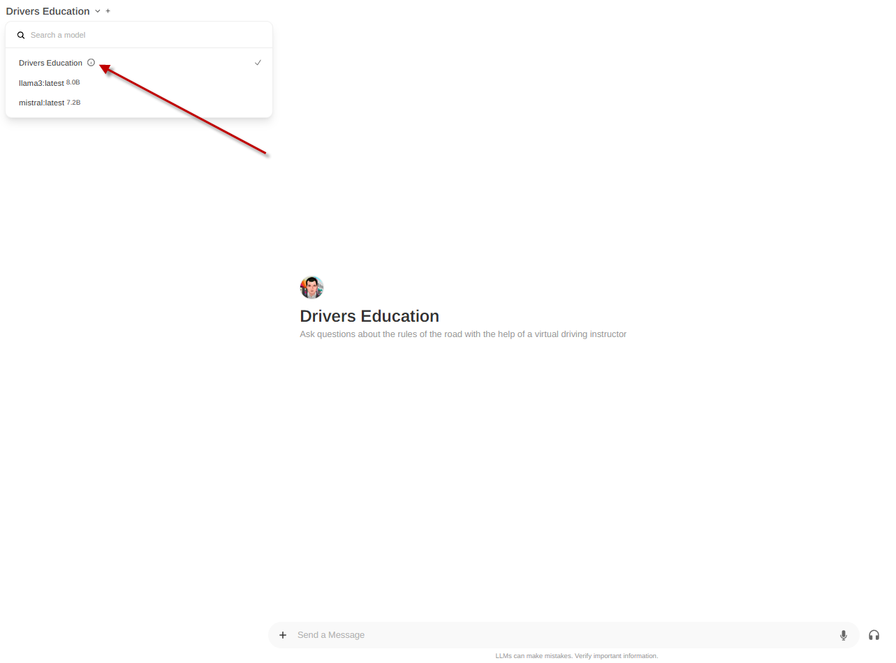 </td> 
    <td>
      <OL>
         <LI>Visit https://openwebui.com/m/sodkgb/drivers_education:latest
         <LI> Select Get 
        <li> Enter: http://localhost:3000
          <LI> Select Save & Create
        <LI> You can now select the Drivers Education Model from the drop down menu
      </ol>      
    </td>
  </tr>  
        <tr>
    <td colspan="3">
<b>Congratulations you can now run the custom Drivers Education Model!</b>
    
    </td>
  </tr>  
</table> 

<h1>Local Install of Custom GUI </h1>
<table>
  <tr>
    <th>Step</th>
    <th>Screenshot</th>
    <th>Description</th>
  </tr>   
        <tr>
    <td>Install Python for Windows    </td>
    <td></td>
    <td> <a href="https://www.python.org/downloads/" target="new">Download Python for Windows</a> and follow instructions for installation. </td>
  </tr>
   <tr>
    <td>Install Ollama for Windows    </td>
    <td></td>
    <td> <a href="https://ollama.com" target="new">Download Ollama for Windows</a> and follow instructions for installation.    </td>
  </tr>
    <tr>
    <td>Pull LLM for Ollama  </td> 
    <td></td>
    <td>In windows, type <b>cmd</b> in the start menu to bring up command window.  Then type the following:  
    ollama pull llama3
    </td>
  </tr>  
  </tr>
  <tr>
    <td>Create local directory for this example   </td>
    <td>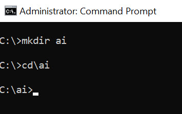</td>
    <td>In windows, type <b>cmd</b> in the start menu to bring up command window.  Then type the following:  
    cd\ 
    mkdir ai 
    cd\ai 
    You should see this c:\ai      
    </td>
  </tr>  
   <tr>
    <td>Clone github package (While in the c:\ai directory) first timers may need to install - https://gitforwindows.org/ (restart of pc recommended)   
</td>
    <td>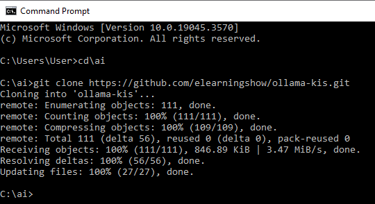</td>
    <td>In windows, type <b>cmd</b> in the start menu to bring up command window.  Then type the following:  
     git clone https://github.com/elearningshow/ollama-kis.git   
This will download all the required files to your pc.   </td>
  </tr>
    <tr>
    <td>Copy/Move Test Project   </td>
    <td>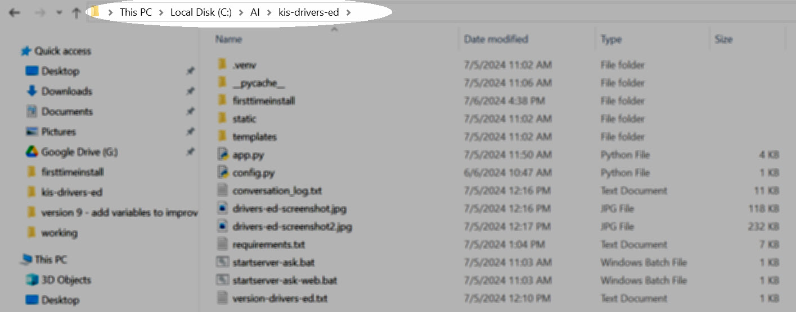</td>
    <td>To ease setup copy the contents of kis-drivers-ed to c:\ai\kis-drivers-ed   </td>
  </tr>  
   <tr>
    <td>Activate python environment   </td>
    <td>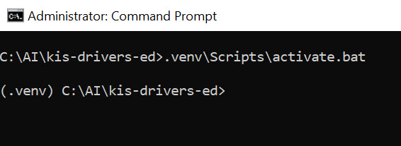</td>
    <td>In windows, type <b>cmd</b> in the start menu to bring up command window.  Then type the following:  
    .venv\Scripts\activate.bat    </td>
  </tr>  
  <tr>
    <td>Install requirements    </td>
    <td>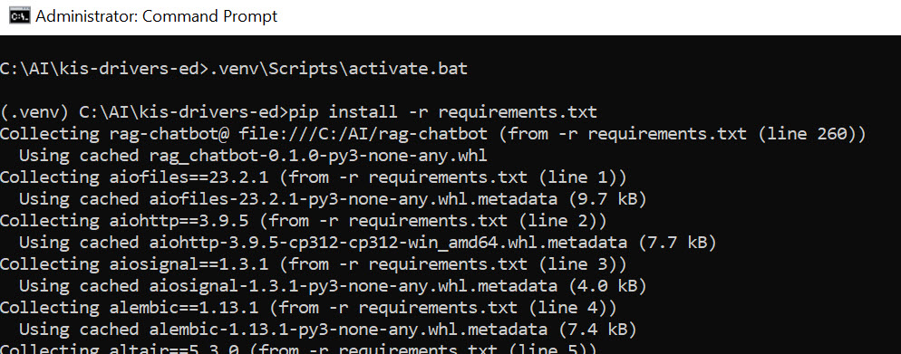</td>
    <td>In windows, type <b>cmd</b> in the start menu to bring up command window.  Then type the following:  
    python.exe -m pip install --upgrade pip   
    pip install -r requirements.txt</td>
  </tr>  
     <tr>
    <td>Configure    </td>
    <td>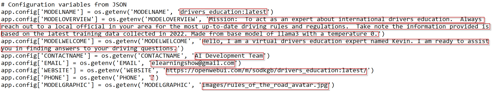 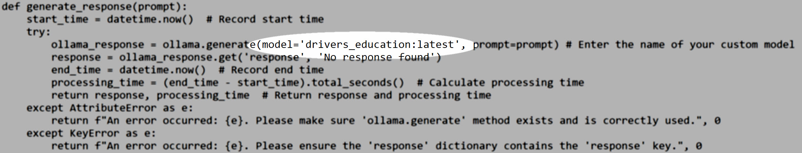</td>
    <td>You can use a basic text editor such as <a href="https://notepad-plus-plus.org/downloads/" target="new">Notepad++</a>, open the file named app.py and revise the content to make your own unique LLM.     This LLM will be limited to the content found within the cloned base model and any additional RAG files used with the selected model.</td>
  </tr>  
   <tr>
    <td>Run - Custom LLM Model (This file will open your default browser, start a local server)   </td>
    <td>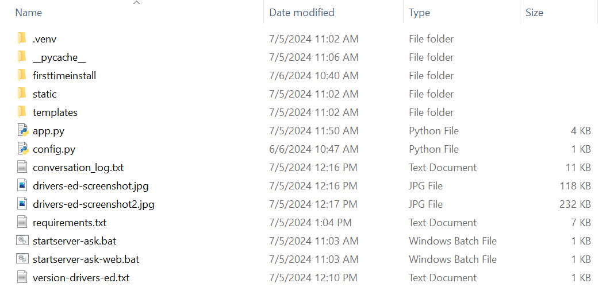</td>
    <td>In windows, browse to view the content in the AI folder.  Then select the following:  
    startserver-ask.bat   </td>
  </tr>  
          <tr>
    <td colspan="3">
<b>Congratulations you can now run the custom Drivers Education Model with a basic user interface. </b>
    
    </td>
  </tr>  
</table> 

