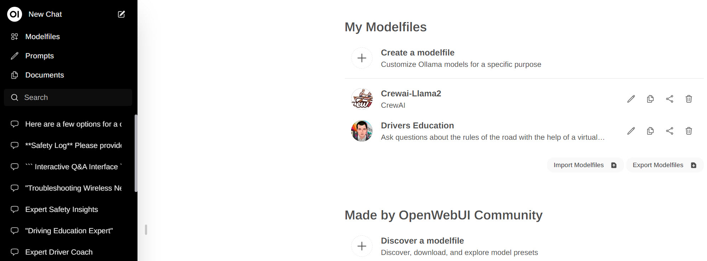
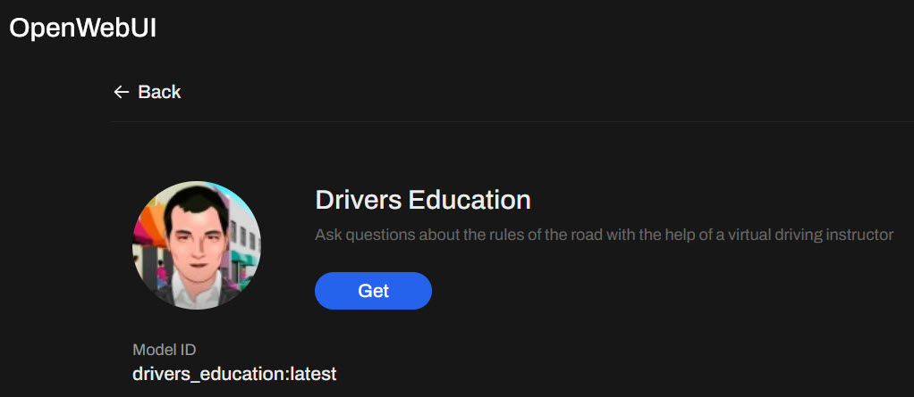

  

<h1>Installation</h1> 

 <table>
  <tr>
    <th>Step</th>
    <th>Screenshot</th>
    <th>Description</th>
  </tr>   
      <tr>
    <td>Install Python for Windows    </td>
    <td></td>
    <td> <a href="https://www.python.org/downloads/" target="new">Download Python for Windows</a> and follow instructions for installation. </td>
  </tr>
   <tr>
    <td>Install Ollama for Windows    </td>
    <td></td>
    <td> <a href="https://ollama.com" target="new">Download Ollama for Windows</a> and follow instructions for installation.   </td>
  </tr>
      <tr>
    <td>Install Docker Desktop for Windows    </td>
    <td> </td>
    <td> <a href="https://www.docker.com/products/docker-desktop/" target="new">Download Docker Desktop for Windows</a> and follow instructions for installation.   </td>
  </tr> 
  <tr>
    <td>Install <a href="https://docs.openwebui.com" target="new">Open WebUI </a>  </td>
    <td> </td>
    <td>In windows, type <b>cmd</b> in the start menu to bring up command window.  Then type the following:  
      docker run -d -p 3000:8080 --add-host=host.docker.internal:host-gateway -v open-webui:/app/backend/data --name open-webui --restart always ghcr.io/open-webui/open-webui:main
</td>
  <tr>
    <td>Pull LLM for Ollama  </td> 
    <td></td>
    <td>In windows, type <b>cmd</b> in the start menu to bring up command window.  Then type the following:  
    ollama pull llama3
    </td>
  </tr>  
  </tr>
     <tr>
    <td>Get Open WebUI Model   </td>
    <td> </td>
    <td><a href="https://openwebui.com/m/sodkgb/drivers_education:latest/" target="new">Download Open WebUI model for Drivers Education</a> select get to have it added to your local models.   
</td>
  </tr>
  <tr>
    <td>Create local directory for this example   </td>
    <td></td>
    <td>In windows, type <b>cmd</b> in the start menu to bring up command window.  Then type the following:  
    cd\ 
    mkdir ai 
    cd\ai 
    You should see this c:\ai      
    </td>
  </tr>  
   <tr>
    <td>Clone github package (While in the c:\ai directory) first timers may need to install - https://gitforwindows.org/ (restart of pc recommended)   
</td>
    <td></td>
    <td>In windows, type <b>cmd</b> in the start menu to bring up command window.  Then type the following:  
     git clone https://github.com/elearningshow/ollama-kis.git   
This will download all the required files to your pc.   </td>
  </tr>
    <tr>
    <td>Copy/Move Test Project   </td>
    <td></td>
    <td>To ease setup copy the contents of kis-drivers-ed to c:\ai\kis-drivers-ed   </td>
  </tr>  
   <tr>
    <td>Activate python environment   </td>
    <td></td>
    <td>In windows, type <b>cmd</b> in the start menu to bring up command window.  Then type the following:  
    .venv\Scripts\activate.bat    </td>
  </tr>  
  <tr>
    <td>Install requirements    </td>
    <td></td>
    <td>In windows, type <b>cmd</b> in the start menu to bring up command window.  Then type the following:  
    pip install -r requirements.txt</td>
  </tr>  
   <tr>
    <td>Run - Custom LLM Model (This file will open your default browser, start a local server)   </td>
    <td></td>
    <td>In windows, browse to view the content in the AI folder.  Then select the following:  
    startserver-ask.bat   </td>
  </tr>  
</table> 

